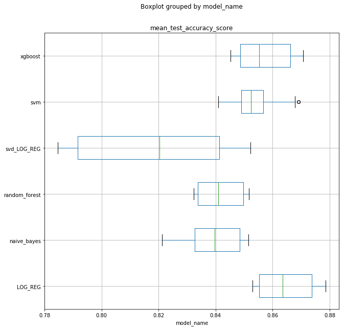
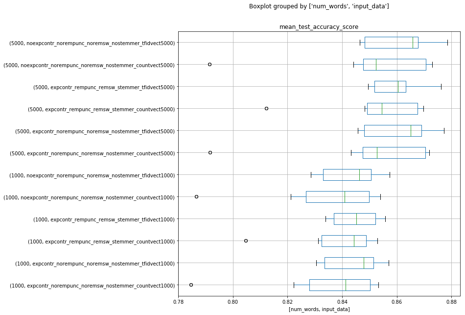
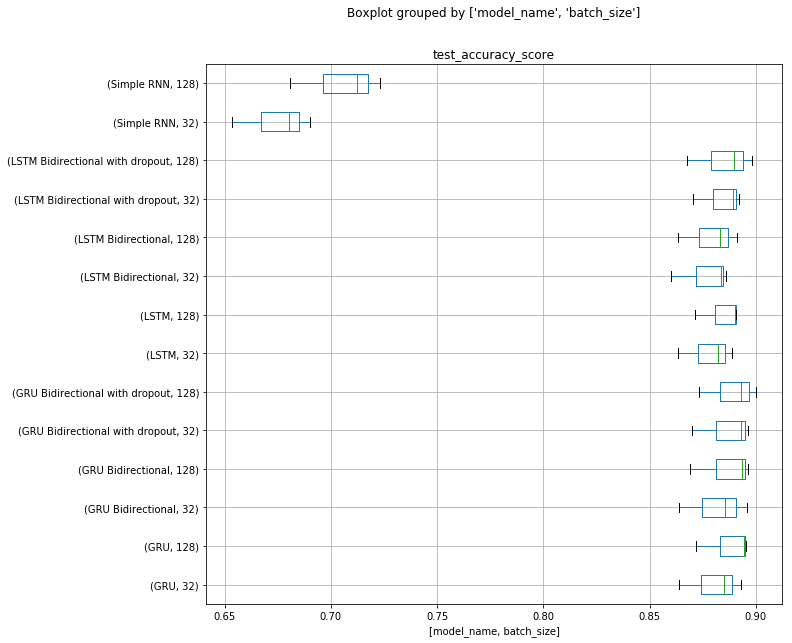
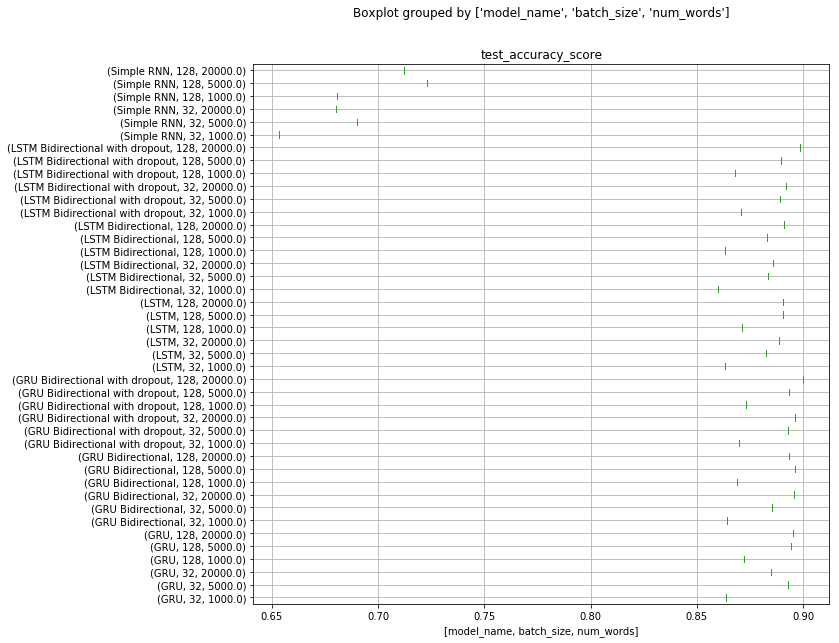
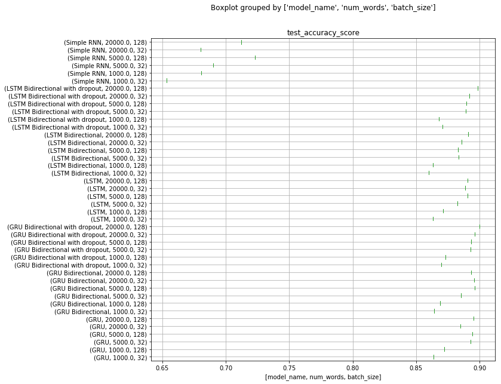

## Introduction

**Project name:** Sentiment analysis for IMDB reviews  
Autor: Tomasz Ostaszewicz  
Implementation: pandas, matplotlib, scikit-learn, keras.

**Description:** This is sentiment analysis for IMDB reviews. The aim of the analysis is to predict if movie review from IMDB is positive or negative (binary classification problem). To predict sentiment different combinations of preprocessing schemes and diffrent machine learning and deep learning models were used, including:

1. Classical machine learning models:
    1. Data preprocessing: removing stop words, removing punctuation, expanding contractions, stemming.
    2. Model input data in the form of: Count variables, TFidf variables.
    2. Models: Logistic Regression, SVM, Random Forest, Naive Bayes, XGBoost.
2. Deep learning models:
    1. Data preprocessing: removing punctuation.
    2. Model input data in the form of: Embeddings (from Glove model).
    3. Models: Simple RNN, LSTM, LSTM Bidirectional, LSTM Bidirectional with dropout, GRU, GRU Bidirectional, GRU Bidirectional with dropout.

Assumptions about sample split:
1. Number of observations in sample with known labels: 25 000.
2. Split:
   a. 20 000 observations for training sample,
   b. 5 000 observations for hold-out sample (below called test sample).
3. For classical machine learning models training is done on 20 000 observations using 3-kfold cross-validation.
4. For deep learning models training was done on 15 000 observation from training sample, the rest 5 000 observations (from sample described in 2.a.) was used as validation set (e.g. for Early Stopping criterion).
5. Additional test dataset from Kaggle with 25 000 observations does not contain target variable. It was used as additional independent verification of a few best models.

## Summary of results of classical machine learning models

Show 10 best results for classical machine learning models.

<table border="1" class="dataframe">
  <thead>
    <tr style="text-align: right;">
      <th></th>
      <th>measure_value</th>
      <th>input_data</th>
      <th>model_name</th>
      <th>best_params</th>
      <th>mean_train_accuracy_score</th>
      <th>mean_test_accuracy_score</th>
      <th>mean_train_test_accuracy_score_dif</th>
      <th>mean_train_roc_auc_score</th>
      <th>mean_test_roc_auc_score</th>
      <th>mean_train_test_auc_roc_score_dif</th>
    </tr>
  </thead>
  <tbody>
    <tr>
      <th>10</th>
      <td>0.87850</td>
      <td>noexpcontr_norempunc_noremsw_nostemmer_tfidvec...</td>
      <td>LOG_REG</td>
      <td>{'model__C': 1, 'model__penalty': 'l2'}</td>
      <td>0.920250</td>
      <td>0.87850</td>
      <td>0.041750</td>
      <td>0.975187</td>
      <td>0.948453</td>
      <td>0.026734</td>
    </tr>
    <tr>
      <th>6</th>
      <td>0.87735</td>
      <td>expcontr_norempunc_noremsw_nostemmer_tfidvect5...</td>
      <td>LOG_REG</td>
      <td>{'model__C': 1, 'model__penalty': 'l2'}</td>
      <td>0.920300</td>
      <td>0.87735</td>
      <td>0.042950</td>
      <td>0.975060</td>
      <td>0.948393</td>
      <td>0.026667</td>
    </tr>
    <tr>
      <th>2</th>
      <td>0.87625</td>
      <td>expcontr_rempunc_remsw_stemmer_tfidvect5000</td>
      <td>LOG_REG</td>
      <td>{'model__C': 1, 'model__penalty': 'l2'}</td>
      <td>0.917400</td>
      <td>0.87625</td>
      <td>0.041150</td>
      <td>0.973973</td>
      <td>0.946348</td>
      <td>0.027625</td>
    </tr>
    <tr>
      <th>8</th>
      <td>0.87300</td>
      <td>noexpcontr_norempunc_noremsw_nostemmer_countve...</td>
      <td>LOG_REG</td>
      <td>{'model__C': 0.1, 'model__penalty': 'l2'}</td>
      <td>0.955025</td>
      <td>0.87300</td>
      <td>0.082025</td>
      <td>0.991178</td>
      <td>0.940026</td>
      <td>0.051152</td>
    </tr>
    <tr>
      <th>4</th>
      <td>0.87195</td>
      <td>expcontr_norempunc_noremsw_nostemmer_countvect...</td>
      <td>LOG_REG</td>
      <td>{'model__C': 0.1, 'model__penalty': 'l2'}</td>
      <td>0.954975</td>
      <td>0.87195</td>
      <td>0.083025</td>
      <td>0.991101</td>
      <td>0.940112</td>
      <td>0.050989</td>
    </tr>
    <tr>
      <th>68</th>
      <td>0.87070</td>
      <td>noexpcontr_norempunc_noremsw_nostemmer_countve...</td>
      <td>xgboost</td>
      <td>{'model__learning_rate': 0.3, 'model__n_estima...</td>
      <td>0.994900</td>
      <td>0.87070</td>
      <td>0.124200</td>
      <td>0.999811</td>
      <td>0.941696</td>
      <td>0.058115</td>
    </tr>
    <tr>
      <th>64</th>
      <td>0.87040</td>
      <td>expcontr_norempunc_noremsw_nostemmer_countvect...</td>
      <td>xgboost</td>
      <td>{'model__learning_rate': 0.3, 'model__n_estima...</td>
      <td>0.994825</td>
      <td>0.87040</td>
      <td>0.124425</td>
      <td>0.999806</td>
      <td>0.940958</td>
      <td>0.058849</td>
    </tr>
    <tr>
      <th>0</th>
      <td>0.86980</td>
      <td>expcontr_rempunc_remsw_stemmer_countvect5000</td>
      <td>LOG_REG</td>
      <td>{'model__C': 0.1, 'model__penalty': 'l2'}</td>
      <td>0.949750</td>
      <td>0.86980</td>
      <td>0.079950</td>
      <td>0.988903</td>
      <td>0.936589</td>
      <td>0.052314</td>
    </tr>
    <tr>
      <th>30</th>
      <td>0.86905</td>
      <td>expcontr_norempunc_noremsw_nostemmer_tfidvect5...</td>
      <td>svm</td>
      <td>{'model__C': 100, 'selection__n_components': 500}</td>
      <td>0.883100</td>
      <td>0.86905</td>
      <td>0.014050</td>
      <td>0.950675</td>
      <td>0.940928</td>
      <td>0.009747</td>
    </tr>
    <tr>
      <th>34</th>
      <td>0.86775</td>
      <td>noexpcontr_norempunc_noremsw_nostemmer_tfidvec...</td>
      <td>svm</td>
      <td>{'model__C': 100, 'selection__n_components': 500}</td>
      <td>0.881775</td>
      <td>0.86775</td>
      <td>0.014025</td>
      <td>0.950578</td>
      <td>0.940872</td>
      <td>0.009706</td>
    </tr>
  </tbody>
</table>

Graph below presents results for each classical machine learning model type for different preprocessing schemes and different hyperparameters.

The best model is Logistic Regression which is slightly surprising. XGBoost and SVM are slightly worse.
It is possible that better tuning of hyperparameters for XGBoost and SVM could result in better performance.
Using SVD to preselect variables for Logistic Regression gives unsatisfactory results.
Logistic regression gives the best accuracy score (0.87850).

Graph below presents impact of different preprocessing schemes for accuracy results.

Data above are group by number of words (5000 - first part, 1000 word - second part)
Using 1000 words as a base for estimation gives noticeable worse result than estimation on 5000 words.
Preprocessing data (expanding contraction, removing punctuation and stop words and using stemmer) gives slightly worse performance than data which are not preprocessed in any way. In chart above TFIdf and Count Vectorizers interweave. It is noticeable that using count vectorizer gives slightly worse performance than using TFidf Vectorizer.

## Summary of results of deep learning models

Show 10 best results for deep learning models.

<table border="1" class="dataframe">
  <thead>
    <tr style="text-align: right;">
      <th></th>
      <th>input_data</th>
      <th>model_name</th>
      <th>batch_size</th>
      <th>train_accuracy_score</th>
      <th>test_accuracy_score</th>
      <th>num_words</th>
    </tr>
  </thead>
  <tbody>
    <tr>
      <th>41</th>
      <td>nostemmer_nosw_punc_expcontr__rnn_tokenizer_20000</td>
      <td>GRU Bidirectional with dropout</td>
      <td>128</td>
      <td>0.92825</td>
      <td>0.9000</td>
      <td>20000.0</td>
    </tr>
    <tr>
      <th>35</th>
      <td>nostemmer_nosw_punc_expcontr__rnn_tokenizer_20000</td>
      <td>LSTM Bidirectional with dropout</td>
      <td>128</td>
      <td>0.92290</td>
      <td>0.8984</td>
      <td>20000.0</td>
    </tr>
    <tr>
      <th>40</th>
      <td>nostemmer_nosw_punc_expcontr__rnn_tokenizer_20000</td>
      <td>GRU Bidirectional with dropout</td>
      <td>32</td>
      <td>0.92250</td>
      <td>0.8964</td>
      <td>20000.0</td>
    </tr>
    <tr>
      <th>25</th>
      <td>nostemmer_nosw_punc_expcontr__rnn_tokenizer_5000</td>
      <td>GRU Bidirectional</td>
      <td>128</td>
      <td>0.93255</td>
      <td>0.8962</td>
      <td>5000.0</td>
    </tr>
    <tr>
      <th>38</th>
      <td>nostemmer_nosw_punc_expcontr__rnn_tokenizer_20000</td>
      <td>GRU Bidirectional</td>
      <td>32</td>
      <td>0.93180</td>
      <td>0.8958</td>
      <td>20000.0</td>
    </tr>
    <tr>
      <th>37</th>
      <td>nostemmer_nosw_punc_expcontr__rnn_tokenizer_20000</td>
      <td>GRU</td>
      <td>128</td>
      <td>0.95155</td>
      <td>0.8952</td>
      <td>20000.0</td>
    </tr>
    <tr>
      <th>23</th>
      <td>nostemmer_nosw_punc_expcontr__rnn_tokenizer_5000</td>
      <td>GRU</td>
      <td>128</td>
      <td>0.93345</td>
      <td>0.8942</td>
      <td>5000.0</td>
    </tr>
    <tr>
      <th>39</th>
      <td>nostemmer_nosw_punc_expcontr__rnn_tokenizer_20000</td>
      <td>GRU Bidirectional</td>
      <td>128</td>
      <td>0.93740</td>
      <td>0.8934</td>
      <td>20000.0</td>
    </tr>
    <tr>
      <th>27</th>
      <td>nostemmer_nosw_punc_expcontr__rnn_tokenizer_5000</td>
      <td>GRU Bidirectional with dropout</td>
      <td>128</td>
      <td>0.93560</td>
      <td>0.8932</td>
      <td>5000.0</td>
    </tr>
    <tr>
      <th>26</th>
      <td>nostemmer_nosw_punc_expcontr__rnn_tokenizer_5000</td>
      <td>GRU Bidirectional with dropout</td>
      <td>32</td>
      <td>0.92855</td>
      <td>0.8930</td>
      <td>5000.0</td>
    </tr>
  </tbody>
</table>

Graph below shows accuracy for batch size and model type.

Graph below shows accuracy score for each model type, batch size and number of words used in embeddings.

Graph below shows accuracy score for each model type, number of words used in embeddings and batch size.

**Conclusions for deep learning models' results:**

1. Usually batch size 128 gives better results than batch size 32, but batch size 128 takes much more time to estimate.
2. Usually estimation on 20000 words gives within model type the best results (comparing to 1000 and 5000 words).
3. The best accuracy on test sample is reached by GRU Bidirectional with dropout model estimated on 128 batch size and 20000 words.

## Comparison of classical models with deep learning models

The table below shows 10 best result among combined classical and deep learning model (each model type was included only once).

<table border="1" class="dataframe">
  <thead>
    <tr style="text-align: right;">
      <th></th>
      <th>model_rank</th>
      <th>model_name</th>
      <th>test_accuracy_score</th>
    </tr>
  </thead>
  <tbody>
    <tr>
      <th>41</th>
      <td>1.0</td>
      <td>GRU Bidirectional with dropout</td>
      <td>0.90000</td>
    </tr>
    <tr>
      <th>35</th>
      <td>1.0</td>
      <td>LSTM Bidirectional with dropout</td>
      <td>0.89840</td>
    </tr>
    <tr>
      <th>25</th>
      <td>1.0</td>
      <td>GRU Bidirectional</td>
      <td>0.89620</td>
    </tr>
    <tr>
      <th>37</th>
      <td>1.0</td>
      <td>GRU</td>
      <td>0.89520</td>
    </tr>
    <tr>
      <th>33</th>
      <td>1.0</td>
      <td>LSTM Bidirectional</td>
      <td>0.89100</td>
    </tr>
    <tr>
      <th>31</th>
      <td>1.0</td>
      <td>LSTM</td>
      <td>0.89060</td>
    </tr>
    <tr>
      <th>10</th>
      <td>1.0</td>
      <td>LOG_REG</td>
      <td>0.87850</td>
    </tr>
    <tr>
      <th>68</th>
      <td>1.0</td>
      <td>xgboost</td>
      <td>0.87070</td>
    </tr>
    <tr>
      <th>30</th>
      <td>1.0</td>
      <td>svm</td>
      <td>0.86905</td>
    </tr>
    <tr>
      <th>14</th>
      <td>1.0</td>
      <td>svd_LOG_REG</td>
      <td>0.85220</td>
    </tr>
    <tr>
      <th>40</th>
      <td>1.0</td>
      <td>random_forest</td>
      <td>0.85170</td>
    </tr>
    <tr>
      <th>50</th>
      <td>1.0</td>
      <td>naive_bayes</td>
      <td>0.85145</td>
    </tr>
    <tr>
      <th>15</th>
      <td>1.0</td>
      <td>Simple RNN</td>
      <td>0.72300</td>
    </tr>
  </tbody>
</table>

**Conclusion**  
Deep learning models on IMDB dataset perform better than classical models (except for Simple RNN).

## Assessment on Kaggle test set

Kaggle test set was used for independent verification of quality of estimated models. Kaggle tutorial competition uses ROC metrics for model evaluation.

<table border="1" class="dataframe">
  <thead>
    <tr style="text-align: right;">
      <th></th>
      <th>train_accuracy_score</th>
      <th>train_roc_auc_score</th>
      <th>kaggle_roc_auc_score</th>
    </tr>
  </thead>
  <tbody>
    <tr>
      <th>log_reg_trained_on_X_train</th>
      <td>0.91605</td>
      <td>0.973614</td>
      <td>0.88140</td>
    </tr>
    <tr>
      <th>log_reg_trained_on_X_all</th>
      <td>0.91588</td>
      <td>0.973137</td>
      <td>0.88176</td>
    </tr>
    <tr>
      <th>GRU_trained_on_X_train</th>
      <td>0.93630</td>
      <td>0.981974</td>
      <td>0.96035</td>
    </tr>
    <tr>
      <th>GRU_trained_on_X_all</th>
      <td>0.94392</td>
      <td>0.985081</td>
      <td>0.96446</td>
    </tr>
  </tbody>
</table>

ROC_AUC value equal to 0.96446 gives 39 position in Kaggle tutorial competition leader board (among 528 teams)  
Link for the tutorial competition:  
https://www.kaggle.com/c/word2vec-nlp-tutorial

## Final conclusions

#### Classical machine learning models:

1. The best model among classical models is Logistic Regression which is slightly surprising. 
2. XGBoost and SVM are slightly worse (SVM is calculated on 500 variables resulting from SVD decomposition).
3. It is possible that better tuning of hyperparameters for XGBoost and SVM could result in better performance (at least reaching logistic regression level).
4. Using SVD to preselect variables for Logistic Regression gives unsatisfactory results.
5. Logistic regression gives the best test accuracy score (0.87850)
6. Using 1000 words as a base for estimation gives noticeable worse result than estimation on 5000 most popular words.
7. Preprocessing data (expanding contraction, removing punctuation and stop words and using stemmer) gives slightly worse performance than data which are not preprocessed in any way.
8. Using count vectorizer gives slightly worse performance than using TFidf Vectorizer.

#### Deep learning models:

1. Usually batch size 128 gives better results than batch size 32, but batch size 128 takes much more time to estimate.
2. Usually estimation on 20000 words gives within model type the best results (comparing to 1000 and 5000 words).
3. The best accuracy (0.90000) on test sample is reached by GRU Bidirectional with dropout model estimated on 128 batch size and 20000 words.

#### Kaggle tutorial competition:

1. ROC_AUC value equal to 0.96446 (from GRU Bidirectional with dropout model) gives 39 position in Kaggle tutorial competition leader board (among 528 teams).
2. ROC_AUC for Logistic regression model is 0.88176 which is significantly worse than result from GRU Bidirectional with dropout model (0.96446).

#### Classical machine learning models vs deep learning models:

1. Deep learning models on IMDB dataset perform better (max. test accuracy = 0.9000) than classical models (max. test accuracy = 0.87850) (except for Simple RNN).
